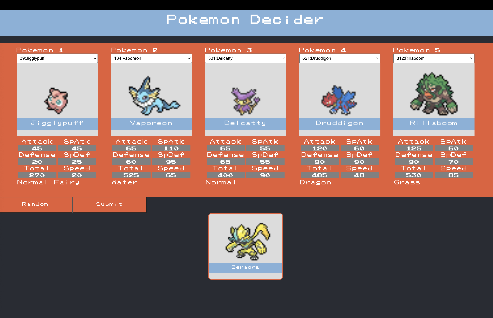

# This Branch is a stepping stone onto which great trainers will plan their attacks
There will be bountiful battles won and plentiful pokemon slain as a result of 
the work me and my men are doing. We charged into the battle against strategy 
and besiege the ignorance of all the trainers who do not know the optimal 
choice to make. For we will make it for them! 

### Specifications

* **Name** :        bestDisplay
* **Builds off** :  1.0.3
* **Purpose** :  This branch takes the functionality of 1.0.3 and adds dynamic element creation for the best pokemon.

to run:
1. go to frontend folder
2. use command "npm start" for frontend
3. use command "npm run start-backend" for backend

### User Interface

&nbsp;

##### Tips: 
* Use the Random button first then change the pokemon accordingly so that the backend gets all the data in one packet instead of individually.
* If the submit button turns green then turns back to red without displaying the pokemon, then there was a error. Just press random again and then try again.
